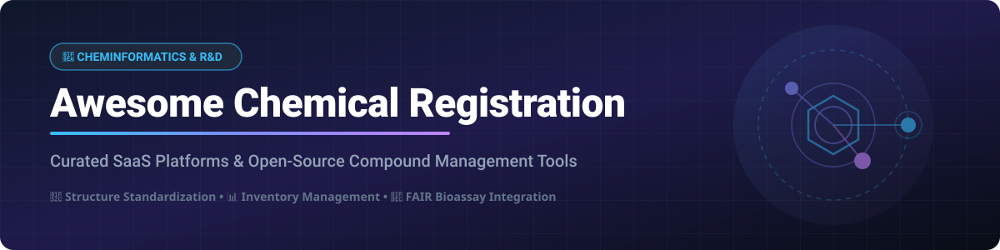

# 🧪 Awesome Chemical Registration ⚗️

  
  
  
  
  

## 🔬 Top Chemical Registration Platforms & Cheminformatics Ecosystem

A curated list of **Chemical Registration software**, **Electronic Lab Notebooks (ELN)**, **Laboratory Information Management Systems (LIMS)**, and **open-source chemical inventory management systems**. 

These industry-leading tools assist research laboratories, biotechnology startups, pharmaceutical enterprises, and academic institutions in registering chemical compounds, standardizing 2D/3D molecular structures, managing reagent inventory, enforcing GHS/ISO-17025 compliance, and seamlessly integrating bioassay datasets.

---

## 📌 Table of Contents

- [📊 Sector Overview & Market Size](#-sector-overview--market-size)
- [☁️ SaaS & Hosted Platforms](#%EF%B8%8F-saas--hosted-platforms)
- [💻 Open-Source GitHub Projects](#-open-source-github-projects)
- [🤝 How to Contribute](#-how-to-contribute)
- [⚠️ Disclaimer](#%EF%B8%8F-disclaimer)
- [❤️ Support & Sponsorship](#%EF%B8%8F-support--sponsorship)
- [📈 Star History](#-star-history)

---

## 📊 Sector Overview & Market Size

> [!NOTE]
> The global **Chemical Registration & Laboratory Informatics (ELN/LIMS/Cheminformatics) Market** is estimated at **$3.8 Billion USD in 2026** (projected to reach ~$5.9 Billion by 2031 at a ~9.2% CAGR). The market is **moderately fragmented**, featuring established enterprise incumbents (Siemens/Dotmatics, Dassault Systèmes BIOVIA, Certara/ChemAxon) alongside high-growth cloud-native platforms (CDD Vault, Scispot, eLabNext) and a thriving open-source ecosystem (eLabFTW, Chemotion, MolTrack).

---

## ☁️ SaaS & Hosted Platforms

Below is a detailed comparison of top commercial Chemical Registration and LIMS platforms, sorted by parent company size / valuation in descending order.

| Platform 🚀 | Description 📝 | Starting Pricing 💰 | Free Tier / Trial Limits ⏳ | Company Valuation / Revenue 🏢 |
| :--- | :--- | :--- | :--- | :--- |
| **[BIOVIA CISPro](https://www.3ds.com/)** | Enterprise chemical inventory, safety, and hazardous material management across global sites. | Contact sales (~$15,000/yr enterprise quote) | Customized demo upon request; no self-serve free trial | **$31.5 Billion Market Cap** / ~$7.3 Billion annual revenue (Dassault Systèmes) |
| **[Dotmatics Studies](https://www.dotmatics.com/)** | Cloud R&D platform combining chemistry ELN, assay integration, and compound registration. | Custom quote (~$10,000+/yr base enterprise) | Personalized demo upon request; no public self-serve trial | **$5.1 Billion Acquisition** by Siemens (~$300 Million revenue) |
| **[Signals Notebook](https://www.dotmatics.com/)** | Dotmatics' cloud-native ELN with chemical structure drawing, registration, and substructure search. | Custom quote (~$1,200/user/yr enterprise) | 14-day evaluation trial upon sales request | **$5.1 Billion Acquisition** by Siemens (~$300 Million revenue) |
| **[ChemAxon Instant JChem](https://chemaxon.com/)** | Structure search, property calculation, and database registration desktop & web platform. | Commercial annual license (~$2,500/user/yr) | 30-day evaluation license available upon request | **Part of Certara ($2.8 Billion Market Cap)** (~$380 Million revenue) |
| **[CDD Vault](https://www.collaborativedrug.com/)** | Collaborative drug discovery vault for chemical registration, bioassay data, and ELN capabilities. | Custom quote (~$5,000/yr starting biotech tier) | Personalized trial with test datasets upon request | **~$25 Million Revenue** (Established private company) |
| **[Scilligence ELN](https://scilligence.com/)** | Modular cross-platform ELN with chemical structure registration and HELM notation support. | Custom quote (~$3,500/yr modular starting rate) | 14-day personalized trial environment upon request | **~$25 Million Revenue** (11–50 employees) |
| **[LabCollector](https://labcollector.com/)** | Modular LIMS and lab management platform with chemical inventory & structure tracking modules. | €180/year (or ~$3,900 one-time perpetual license) | 30-day full feature free trial | **~$15 Million Revenue** (AgileBio) |
| **[eLabNext](https://www.elabnext.com/)** | Integrated digital lab platform combining ELN, LIMS, and chemical compound registration. | €14.50/user/month (billed annually) | 30-day free trial with full ELN & inventory features | **$10.6 Million Revenue** (SciSure merged entity) |
| **[Scispot](https://www.scispot.com/)** | Tech-forward lab operating layer combining ELN, LIMS, and automated chemical registration workflows. | $9,000/year base contract (unlimited seats) | Free "Digital Brain" assessment & sandbox demo | **$8 Million+ Raised** (~$2.8 Million ARR) |
| **[ChemInventory](https://www.cheminventory.net/)** | Cloud chemical inventory tracking reagents, containers, SDS, and storage locations. | $56/year (Paid Tier 1) | **Free Forever Tier**: Up to 15 users & 300 containers (or 30-day trial for higher tiers) | Bootstrapped / Specialized cloud SaaS (~$1 Million ARR) |

---

## 💻 Open-Source GitHub Projects

The open-source ecosystem for chemical compound registration, structure searching, and inventory tracking is mature and production-ready. Projects are listed below sorted by **GitHub Star Count (descending)**.

### 🌟 High-Star Open-Source Repositories

- **[eLabFTW](https://github.com/elabftw/elabftw)**   
  🏆 **The most popular open-source electronic lab notebook.** AGPL-3.0. Features experiment management, reagent inventory, integrated chemical structure drawing (Ketcher), DNA cloning, and a centralized **Compounds Database** for registering structures. Trusted by top research institutes worldwide.

- **[Chemotion ELN](https://github.com/ComPlat/chemotion_ELN)**   
  ⚗️ **Open-source electronic lab notebook designed specifically for chemistry research.** Developed at KIT. Includes chemical structure drawing, reaction planning, automatic InChI/SMILES generation via OpenBabel, and PubChem CAS lookup integration.

- **[lwreg](https://github.com/rinikerlab/lightweight-registration)**   
  ⚡ **Lightweight chemical registration system created by Greg Landrum (RDKit founder).** Pure Python with minimal dependencies. Designed for computational pipelines, capturing both 2D structures and 3D conformers with layered hash duplicate detection. MIT License.

- **[Chemalot](https://github.com/chemalot/chemalot)**   
  🛠️ **Command-line suite for chemical structure registration, validation, and data curation.** Ideal for building custom automated chemistry ETL pipelines.

- **[Phoenix ELN](https://github.com/abrechts/Phoenix-ELN)**   
  🧪 **Open-source ELN for organic, organometallic, and polymer chemistry.** Features chemical reaction drawing, stoichiometric calculators, built-in materials database, and reaction substructure search (RSS).

- **[Open Enventory (US Fork)](https://github.com/khoivan88/open_enventory-modified_for_US)**   
  📦 **Chemical inventory and notebook software for research groups.** Tracks chemical containers, locations, and safety datasheets.

- **[MolTrack](https://github.com/datagrok-ai/mol-track)**   
  🧬 **Full-featured compound registration server.** FastAPI backend powered by **RDKit-enabled PostgreSQL**. Supports compound registration, unique salt/tautomer standardization, duplicate detection, batch/lot management, and REST API integration. MIT License.

- **[Cheminv](https://github.com/tmorrell/cheminv)**   
  🏷️ **Web-based chemical inventory management system.** Built with PHP/MySQL to manage laboratory chemicals, locations, container quantities, and orders.

- **[Organilab](https://github.com/Solvosoft/organilab)**   
  📋 **Virtual inventory management system for chemical substances.** Built for compliance with **ISO-17025 and GHS** laboratory standards.

- **[ChemSearch](https://github.com/ruzx/ChemSearch)**   
  📝 **Chemical substructure search and container inventory toolkit for Obsidian.** Ketcher integration with PubChem LCSS safety linking. MIT License.

- **[ChemTrack](https://github.com/Yashraj221B/chemical-management-frontend)**   
  💻 **Modern React 19 + TypeScript chemical inventory web application.** Features PubChem integration, formula rendering, and container location tracking.

---

## 🤝 How to Contribute

Contributions are highly welcomed! Please follow these simple guidelines:

1. Fork this repository.
2. Add or update entries in `README.md` maintaining table/list formats.
3. Provide factual descriptions, official documentation links, pricing info, or GitHub star counts.
4. Submit a Pull Request explaining your changes.

---

## ⚠️ Disclaimer

This list is community-curated for informational purposes and does not constitute an explicit endorsement. Chemical registration software handles sensitive intellectual property and hazardous materials—always verify compliance with GHS and ISO-17025 regulations before deployment.

---

## ❤️ Support & Sponsorship

If you find this repository helpful for your research, lab operations, or software development, please consider showing your support:

- ⭐ **Star this repository** on GitHub to increase its visibility.
- 🔀 **Fork & Share** it with colleagues in chemistry, biology, and cheminformatics.
- ☕ **Sponsor the Maintainer**: Support ongoing open-source curation and project maintenance via [GitHub Sponsors](https://github.com/sponsors/ishandutta2007).

---

## 📈 Star History

